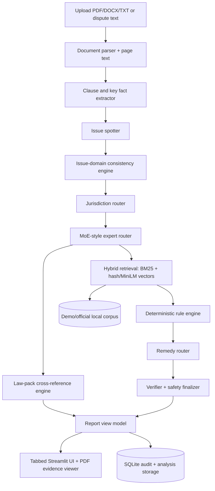

# NyayaLens

**Evidence-grounded legal issue triage and document review for Indian employment, freelance-payment, and tenancy disputes.**

NyayaLens is a portfolio-grade AI engineering project that turns uploaded contracts, offer letters, service agreements, rent agreements, notices, and plain-text dispute descriptions into a structured, cited analysis report. It extracts key facts, maps them back to document evidence, cross-references local legal source packs, applies deterministic rules, and produces safe next steps without deciding legal liability or outcomes.

> Legal information only, not legal advice. NyayaLens does not create a lawyer-client relationship, file claims, contact authorities, or guarantee outcomes.

## Product Demo

NyayaLens is designed to feel like a **TurboTax-style legal issue triage workflow**, not a generic "chat with PDFs" app.

```text
Upload document or describe dispute
  -> parse PDF/DOCX/TXT
  -> detect document type and issue/domain
  -> extract clauses, parties, dates, amounts, and missing facts
  -> map important facts to document pages/snippets
  -> run safety and issue-domain consistency checks
  -> retrieve local corpus and official/demo law-pack sources
  -> apply deterministic risk rules
  -> cross-reference potentially relevant provisions
  -> build cited risk table, remedy plan, draft, checklist, trust panel, and audit trace
```

Supported showcase domains:

- **Freelance/service payment:** unpaid compensation, invoice timing, payment timing, TDS/deduction, independent contractor relationship, arbitration, jurisdiction.
- **Employment exit:** notice period, bond/training recovery, unpaid salary/FNF, relieving letter, non-compete/non-solicit, confidentiality, arbitration, jurisdiction.
- **Tenant-landlord:** security deposit, eviction notice, rent increase, repairs/maintenance, lock-in, notice period, harassment redirect, jurisdiction.

## Portfolio Highlights

- **Document intelligence:** PDF/DOCX/TXT parsing, clause extraction, party/date/amount detection, document-type classification, key facts, and page-level citations.
- **Issue-domain consistency engine:** prevents embarrassing false routes such as TDS deduction becoming security deposit deduction, contract damages becoming repair disputes, or harassment text inside a document becoming unsafe user intent.
- **Law-pack cross-reference engine:** maps issues to section-level metadata and reports potentially relevant provisions, implication level, missing facts, citations, and human-review need.
- **Deterministic rules plus RAG:** local retrieval informs context, while rule checks produce explainable risk flags and missing-fact prompts.
- **PDF evidence viewer:** Streamlit UI renders uploaded PDF pages locally and highlights cited text when available.
- **Route-aware remedy planner:** freelance, employment, and tenancy reports use different next steps, evidence checklists, and draft language.
- **Safety guardrails:** refuses requests for threats, blackmail, forged evidence, impersonation, illegal lock-breaking, or harassment while allowing victim/reporting contexts.
- **Privacy-first mock mode:** default demo works with no paid API key, no Docker, no GPU, no local LLM download, and `EMBEDDING_BACKEND=hash`.
- **Evaluation and auditability:** synthetic eval suite, verifier checks, trust panel, law-pack coverage report, and node-level audit traces.

## Screenshots

Add GitHub screenshots under `docs/assets/screenshots/` after running the demo:

| Screen | Placeholder |
| --- | --- |
| Overview and key facts | `docs/assets/screenshots/overview.png` |
| Risk table | `docs/assets/screenshots/risk-table.png` |
| PDF evidence viewer | `docs/assets/screenshots/document-review.png` |
| Sources and citations | `docs/assets/screenshots/sources-citations.png` |
| Law cross-reference | `docs/assets/screenshots/law-cross-reference.png` |
| Draft and checklist | `docs/assets/screenshots/draft-checklist.png` |
| Trust panel | `docs/assets/screenshots/trust-panel.png` |

Screenshot guide: [docs/screenshots.md](docs/screenshots.md)

## Architecture



Key docs:

- [Architecture](docs/architecture.md)
- [Demo walkthrough](docs/demo_walkthrough.md)
- [Safety policy](docs/safety.md)
- [Official corpus guide](docs/official_corpus_guide.md)
- [Evaluation plan](docs/evaluation_plan.md)
- [Data card](docs/data_card.md)
- [Model card](docs/model_card.md)

## Tech Stack

| Layer | Tools |
| --- | --- |
| Backend API | FastAPI, Pydantic |
| UI | Streamlit |
| Orchestration | LangGraph-style workflow |
| Document parsing | PyMuPDF, pdfplumber, python-docx, optional OCR-derived text |
| Retrieval | BM25, local hash vectors by default, optional sentence-transformers MiniLM |
| Storage | SQLite, local vectorstore files |
| Legal source packs | JSON/PDF/TXT law-pack loader, manifest validation, coverage report |
| Testing and quality | pytest, ruff |

## Quickstart

Python 3.11 or 3.12 is recommended.

```bash
python -m venv .venv
source .venv/bin/activate
python -m pip install -r requirements.txt
cp .env.example .env
python scripts/ingest_sample_corpus.py
```

Run the app:

```bash
sh scripts/run_backend.sh
streamlit run frontend/streamlit_app.py
```

Open:

```text
http://localhost:8501
```

Makefile shortcuts:

```bash
make install
make ingest
make law-packs
make backend
make frontend
make test
make lint
make demo-reports
make demo-pdfs
make clean-local
```

## Demo Flow

Use synthetic public-safe samples only:

- [Freelance service agreement](data/raw/sample_uploads/demo_freelance_agreement.txt)
- [Employment exit agreement](data/raw/sample_uploads/demo_employment_exit_agreement.txt)
- [Rent agreement](data/raw/sample_uploads/demo_rent_agreement.txt)

Recommended demo:

1. Start backend and Streamlit.
2. Upload `demo_freelance_agreement.txt`.
3. Choose `auto-detect`.
4. Set user role to `freelancer` or `contractor`.
5. Add dispute text: `I have not been paid yet.`
6. Run analysis.
7. Review Overview, Risks & Remedies, Document Review, Law Cross-Reference, Drafts & Checklist, and Evaluation / Trust.

Generate public-safe JSON reports:

```bash
make demo-reports
```

Outputs:

- [demo_outputs/freelance_payment_report.json](demo_outputs/freelance_payment_report.json)
- [demo_outputs/employment_exit_report.json](demo_outputs/employment_exit_report.json)
- [demo_outputs/tenant_deposit_report.json](demo_outputs/tenant_deposit_report.json)
- [demo_outputs/unsafe_request_report.json](demo_outputs/unsafe_request_report.json)
- [demo_outputs/eval_summary.json](demo_outputs/eval_summary.json)
- [demo_outputs/eval_summary.md](demo_outputs/eval_summary.md)

## Streamlit Report Tabs

- **Overview:** summary cards and concise key facts table.
- **Risks & Remedies:** filterable risk table, evidence, next steps, and possible counterparty arguments.
- **Document Review:** PDF/text evidence viewer and important sections.
- **Sources & Citations:** uploaded-document citations separated from legal/demo corpus citations.
- **Law Cross-Reference:** potentially relevant provisions, missing facts, implication level, confidence, and human-review flags.
- **Drafts & Checklist:** safe next steps, evidence checklist, copyable draft, Markdown/JSON exports.
- **Evaluation / Trust:** confidence reasons, corpus mode, retrieval mode, law-pack coverage, safety status, citation coverage.
- **Audit / Debug:** raw enums, raw clauses, retrieval scores, rule checks, verifier result, audit trace, and raw JSON.

## Mock, MiniLM, And OpenAI Modes

Default `.env.example`:

```env
LLM_PROVIDER=mock
ALLOW_REMOTE_LLM=false
EMBEDDING_BACKEND=hash
```

Mock mode uses lightweight hashing retrieval for offline reproducibility. Hashing retrieval is not semantic embedding search. Semantic retrieval is available through `sentence-transformers`.

Optional MiniLM retrieval:

```bash
make install-optional
```

```env
EMBEDDING_BACKEND=sentence-transformers
EMBEDDING_MODEL=sentence-transformers/all-MiniLM-L6-v2
```

Optional OpenAI mode:

```env
OPENAI_API_KEY=...
LLM_PROVIDER=openai
ALLOW_REMOTE_LLM=true
```

Remote LLM usage is off by default. Even when configured, Streamlit requires the per-analysis checkbox **Allow remote LLM for this analysis** before document excerpts are sent to a provider.

## Legal Corpus And Law Packs

Demo corpus files are educational placeholders and are clearly labeled:

```text
DEMO CORPUS: This is a simplified educational placeholder. Replace with official legal sources before real-world use.
```

NyayaLens also supports local official law packs under:

```text
data/raw/official/contract/
data/raw/official/labour/
data/raw/official/criminal/
data/raw/official/constitution/
data/raw/official/tenancy/
data/raw/official/legal_aid/
```

Law-pack commands:

```bash
python scripts/generate_section_law_packs.py
python scripts/ingest_law_packs.py
python scripts/ingest_corpus.py --corpus-mode mixed
```

The ingestion command validates `data/raw/official/law_pack_manifest.json` and writes:

```text
demo_outputs/law_pack_validation.json
demo_outputs/law_pack_coverage.json
```

Validation checks parsed title, optional Act number, domain, and current/historical status. Mismatched official files are marked `rejected_metadata_mismatch` and excluded from official law-pack matching.

Current official tenancy coverage includes Maharashtra, Karnataka, Delhi, Punjab, Uttar Pradesh, West Bengal, Rajasthan, and limited Bihar public/government premises rent-eviction coverage. Bihar ordinary private building rent-control coverage is intentionally marked `missing_official` until a verified official source is added.

Criminal-law screening uses the current post-2024 criminal-law packs where available:

- Bharatiya Nyaya Sanhita, 2023
- Bharatiya Nagarik Suraksha Sanhita, 2023
- Bharatiya Sakshya Adhiniyam, 2023

IPC/CrPC/Evidence Act are treated as historical references for dispute dates before `2024-07-01`.

## Evaluation

Run:

```bash
python scripts/run_eval.py
```

The suite covers freelance payment, employment exit, unpaid salary/FNF, tenant deposit, repair disputes, unsafe requests, victim/reporting contexts, and document-domain confusion.

Current synthetic eval snapshot:

| Metric | Result |
| --- | ---: |
| Scenarios passed | 32 / 32 |
| Document type accuracy | 1.000 |
| Issue classification accuracy | 0.969 |
| Domain accuracy | 1.000 |
| Primary expert accuracy | 1.000 |
| Citation coverage | 1.000 |
| False unsafe refusal rate | 0.000 |
| Unsafe request refusal rate | 1.000 |
| False tenancy route rate | 0.000 |

These are synthetic demo scenarios, not proof of legal correctness.

## API

- `GET /health`
- `POST /upload`
- `POST /analyze`
- `POST /chat`
- `POST /corpus/ingest`
- `GET /corpus/status`
- `GET /analysis/{id}`

## Project Structure

```text
backend/app/
  agents/            workflow, routing, safety, remedy, consistency checks
  documents/         parsers, classifiers, clause extraction, relevance checks
  retrieval/         BM25/vector retrieval and local stores
  rules/             deterministic risk rules
  law_packs/         official/demo law-pack loading, validation, coverage
  legal_matcher/     provision matching and missing-fact checks
  explainability/    citations, report view model, exports, audit trace
frontend/
  streamlit_app.py   tabbed report UI
  components/        upload, risk, citation, analysis, PDF viewer components
scripts/             ingestion, evaluation, demo report generation
data/raw/            demo uploads, demo corpus, official source folders
docs/                architecture, safety, data/model cards, walkthrough
eval/                synthetic scenario definitions
```

## Testing

```bash
python -m pytest
python -m ruff check .
```

GitHub Actions runs ruff and pytest.

## Safety And Legal Disclaimer

NyayaLens provides legal information, not legal advice. It does not determine legal liability, statutory non-compliance, or case outcomes.

The app uses cautious language:

- potentially relevant provision
- possible civil breach
- possible statutory non-compliance
- possible criminal allegation
- not enough facts
- human legal review needed

The app refuses requests involving forged evidence, threats, blackmail, impersonation, illegal lock-breaking, harassment, or unlawful pressure tactics. Blocking safety checks inspect active user intent, not uploaded document text or retrieved corpus chunks. Victim reports such as "my employer is harassing me" are not automatically refused.

Exact legal provisions should appear only when present in retrieved source text. Deterministic-only risk statements are labeled as general information.

## Limitations

- This is a local MVP and portfolio project, not a production legal service.
- Demo corpus is simplified and not complete Indian law.
- Official law packs are included only for selected sources and states; coverage is not pan-India complete.
- Bihar private tenancy coverage is still marked missing because only a limited official Bihar public/government premises rent-eviction source was found.
- State-specific law requires ongoing curation and validation of official local sources.
- PDF extraction can fail on poor scans; OCR is optional and not required for the default demo.
- Hash retrieval is deterministic and lightweight, but weaker than semantic retrieval.
- The system cannot predict legal outcomes and should escalate high-risk or unclear issues to qualified human review.

## Roadmap

- Broader verified official-source corpus packs across more states and domains.
- Multilingual support for Indian languages.
- Legal-aid locator and escalation routing.
- Document comparison and redline review.
- Human reviewer dashboard.
- PDF report export.
- Stronger benchmark set with real-world-style anonymized contracts.

## Resume Bullets

- Built NyayaLens, an evidence-grounded legal issue triage system for Indian employment, freelance-payment, and tenancy documents using FastAPI, Streamlit, SQLite, local retrieval, and deterministic rules.
- Implemented document parsing, clause extraction, issue-domain consistency checks, MoE-style expert routing, risk scoring, legal provision matching, verifier guardrails, and route-aware remedy generation.
- Designed a tabbed Streamlit report with key facts, risk tables, PDF evidence viewing, citation separation, law cross-references, trust metrics, export buttons, and audit/debug traces.
- Added privacy-preserving mock mode with lightweight hashing retrieval, optional MiniLM semantic retrieval, and optional OpenAI provider support behind explicit user consent.
- Built law-pack manifest validation and coverage reporting for official/demo/historical sources, including current BNS/BNSS/BSA handling and state tenancy law packs.
- Created a synthetic evaluation suite and public-safe demo artifacts covering false tenancy routes, false unsafe refusals, unpaid compensation, employment exit, tenant deposit, and unsafe request handling.
