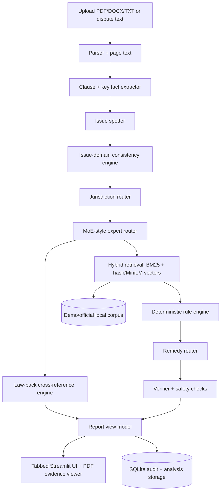

# NyayaLens

**Evidence-grounded legal issue triage for Indian employment, freelance-payment, and tenancy documents.**

NyayaLens extracts key clauses, maps facts to document evidence, checks issue/domain consistency, retrieves local source material, applies deterministic risk rules, and generates citation-backed next steps. It is designed as a **TurboTax-style document review workflow**, not a chatbot wrapper.

> Legal information only, not legal advice. NyayaLens does not create a lawyer-client relationship and does not guarantee outcomes.

## What It Does

```text
Upload document
  -> parse PDF/DOCX/TXT
  -> detect document type
  -> extract clauses and key facts
  -> map evidence to pages/snippets
  -> detect issue/domain
  -> run consistency checks
  -> route expert
  -> retrieve local corpus sources
  -> apply deterministic rules
  -> build risk table and remedy plan
  -> show citations, trust notes, and audit trace
```

Supported MVP domains:

- Employment exit: notice period, bond/training recovery, unpaid salary/FNF, relieving letter, non-compete, arbitration, jurisdiction.
- Freelance/service payment: invoice timing, payment timing, compensation, TDS/deduction, independent contractor relationship, arbitration, jurisdiction.
- Tenant-landlord: security deposit, eviction notice, rent increase, repairs, lock-in, notice period, harassment redirect, jurisdiction.

## Social Impact

Employment exits, freelance payment disputes, and rental deductions are document-heavy and stressful. NyayaLens helps users organize facts, preserve evidence, ask safer written questions, and understand uncertainty before escalation. High-risk or unclear reports are routed toward human legal-aid/lawyer review.

## Why This Is More Than RAG

- Document intelligence: PDF/DOCX/TXT parsing, document type detection, clause extraction, key facts, page-level evidence.
- Issue-domain consistency engine: prevents TDS deduction from becoming security deposit deduction, generic damages from becoming repair disputes, and document harassment text from becoming unsafe intent.
- Law-pack cross-reference engine: maps issues to section-level law-pack metadata and reports potentially implicated provisions, missing facts, and human-review needs without saying a violation is proven.
- Deterministic rules: issue-driven risks are produced even when uploaded documents are irrelevant or clauses are missing.
- PDF evidence viewer: local PyMuPDF rendering with quote highlighting when possible.
- Remedy router: employment, freelance payment, and tenancy drafts/checklists use different language.
- Safety guardrails: unsafe requests are refused; victim reports are not falsely refused.
- Evaluation suite: synthetic scenarios check classification, routing, citations, false unsafe refusals, and false tenancy routes.
- Audit trace: every workflow node records trace metadata.
- Local/mock privacy mode: default runs without paid APIs, Docker, local LLM downloads, or GPU training.

## Architecture



## Quickstart In 5 Commands

```bash
python -m pip install -r requirements.txt
cp .env.example .env
python scripts/ingest_sample_corpus.py
sh scripts/run_backend.sh
streamlit run frontend/streamlit_app.py
```

Open `http://localhost:8501`.

Optional virtualenv:

```bash
python -m venv .venv
source .venv/bin/activate
```

## Make Commands

```bash
make install
make ingest
make law-packs
make backend
make frontend
make test
make lint
make demo-reports
make demo-pdfs
make clean-local
```

## Mock Mode

Default `.env.example`:

```env
LLM_PROVIDER=mock
ALLOW_REMOTE_LLM=false
EMBEDDING_BACKEND=hash
```

Mock mode uses lightweight hashing retrieval for offline reproducibility. Hashing retrieval is not semantic embedding search. Semantic retrieval is available through `sentence-transformers`.

## Optional MiniLM Mode

```bash
make install-optional
```

```env
EMBEDDING_BACKEND=sentence-transformers
EMBEDDING_MODEL=sentence-transformers/all-MiniLM-L6-v2
```

If MiniLM is unavailable, NyayaLens falls back to lightweight hashing retrieval. The default demo does not require local model downloads.

## Optional OpenAI Mode

Remote LLM usage is off by default and provider-gated.

```bash
make install-optional
```

```env
OPENAI_API_KEY=...
LLM_PROVIDER=openai
ALLOW_REMOTE_LLM=true
```

Even then, Streamlit requires the per-analysis checkbox **Allow remote LLM for this analysis** before sending document excerpts to a provider.

## UI Walkthrough

The Streamlit report is organized into tabs:

- Overview: human-readable summary cards and key facts table.
- Risks & Remedies: filterable risk table and possible counterparty arguments.
- Document Review: PDF/text evidence viewer and important sections.
- Sources & Citations: uploaded-document citations separated from demo/legal corpus citations.
- Law Cross-Reference: potentially relevant law-pack provisions, missing facts, implication level, citations, and human-review flag.
- Drafts & Checklist: safe next steps, evidence checklist, copyable draft, Markdown/JSON export.
- Evaluation / Trust: corpus mode, retrieval mode, confidence reasons, missing facts, human review, safety status, citation coverage.
- Audit / Debug: raw enums, clauses, retrieval scores, rule checks, verifier, audit trace, raw JSON.

See [docs/demo_walkthrough.md](docs/demo_walkthrough.md).

## Synthetic Demo Files

Public-safe samples use fake names only:

- [demo_freelance_agreement.txt](data/raw/sample_uploads/demo_freelance_agreement.txt)
- [demo_employment_exit_agreement.txt](data/raw/sample_uploads/demo_employment_exit_agreement.txt)
- [demo_rent_agreement.txt](data/raw/sample_uploads/demo_rent_agreement.txt)

Optional PDFs:

```bash
make demo-pdfs
```

## Demo Outputs

```bash
make demo-reports
```

Outputs:

- [demo_outputs/freelance_payment_report.json](demo_outputs/freelance_payment_report.json)
- [demo_outputs/employment_exit_report.json](demo_outputs/employment_exit_report.json)
- [demo_outputs/tenant_deposit_report.json](demo_outputs/tenant_deposit_report.json)
- [demo_outputs/unsafe_request_report.json](demo_outputs/unsafe_request_report.json)
- [demo_outputs/eval_summary.json](demo_outputs/eval_summary.json)
- [demo_outputs/eval_summary.md](demo_outputs/eval_summary.md)

## Screenshots

Place screenshots under `docs/assets/screenshots/`.

Suggested placeholders:

- `docs/assets/screenshots/overview.png`
- `docs/assets/screenshots/risk-table.png`
- `docs/assets/screenshots/document-review.png`
- `docs/assets/screenshots/sources-citations.png`
- `docs/assets/screenshots/draft-checklist.png`
- `docs/assets/screenshots/trust-panel.png`
- `docs/assets/screenshots/audit-debug.png`

Instructions: [docs/screenshots.md](docs/screenshots.md)

## Corpus Modes

Bundled corpus files are simplified educational placeholders. Each starts with:

```text
DEMO CORPUS: This is a simplified educational placeholder. Replace with official legal sources before real-world use.
```

Official-source-ready directories:

```text
data/raw/official/india_code/
data/raw/official/contract/
data/raw/official/labour/
data/raw/official/criminal/
data/raw/official/constitution/
data/raw/official/tenancy/
data/raw/official/legal_aid/
data/raw/official/consumer/
data/raw/official/grievance/
```

Ingest modes:

```bash
python scripts/ingest_corpus.py --corpus-mode demo
python scripts/ingest_corpus.py --corpus-mode official
python scripts/ingest_corpus.py --corpus-mode mixed
```

Guide: [docs/official_corpus_guide.md](docs/official_corpus_guide.md)

## Law Packs

NyayaLens also supports section-level law packs under:

```text
data/raw/official/contract/
data/raw/official/labour/
data/raw/official/criminal/
data/raw/official/constitution/
data/raw/official/tenancy/
data/raw/official/legal_aid/
```

The repository includes official local law-pack files where available, plus demo placeholders for product behavior and gaps. The Evaluation / Trust tab and `demo_outputs/law_pack_coverage.json` show exactly which packs are official, demo, missing, or historical.

Current official tenancy coverage includes Maharashtra, Karnataka, Delhi, Punjab, Uttar Pradesh, West Bengal, Rajasthan, and limited Bihar public/government premises rent-eviction coverage. Bihar ordinary private building rent-control coverage is intentionally marked `missing_official` until a verified official source is added.

```bash
python scripts/ingest_law_packs.py
```

The ingestion command validates `data/raw/official/law_pack_manifest.json` before loading official law packs. It writes:

```text
demo_outputs/law_pack_validation.json
demo_outputs/law_pack_coverage.json
```

Validation checks parsed title, optional Act number, domain, and current/historical status. Mismatched official files are marked `rejected_metadata_mismatch` and excluded from official law-pack matching. To move rejected files into `data/raw/official/_quarantine/`, run:

```bash
python scripts/ingest_law_packs.py --quarantine-mismatches
```

To generate section-level JSON packs from accepted official PDFs/TXT/DOCX files:

```bash
python scripts/generate_section_law_packs.py
# or
make section-law-packs
```

For current criminal-law screening, NyayaLens prefers BNS/BNSS/BSA packs for disputes on or after `2024-07-01`. IPC/CrPC/Evidence Act are treated as historical references for earlier dispute dates. If official BSA is missing, the Trust tab shows: `Official Bharatiya Sakshya Adhiniyam pack is missing; evidence-law cross-reference may be incomplete.`

After adding, replacing, or correcting official source files, rerun:

```bash
python scripts/generate_section_law_packs.py
python scripts/ingest_law_packs.py
python scripts/ingest_corpus.py --corpus-mode mixed
```

The Law Cross-Reference tab uses cautious wording:

- potentially relevant provision
- possible civil breach
- possible statutory non-compliance
- possible criminal allegation
- not enough facts
- human legal review needed

It does not determine that a law has been broken.

## Evaluation

```bash
python scripts/run_eval.py
```

The scenario suite covers freelance payment, employment exit, unpaid salary/FNF, tenant deposit, repair disputes, unsafe requests, victim/reporting contexts, and document-domain confusion. Results are written to `demo_outputs/eval_summary.json` and `demo_outputs/eval_summary.md`.

Current synthetic eval snapshot:

| Metric | Result |
| --- | ---: |
| Scenarios passed | 32 / 32 |
| Document type accuracy | 1.000 |
| Issue classification accuracy | 0.969 |
| Domain accuracy | 1.000 |
| Primary expert accuracy | 1.000 |
| Citation coverage | 1.000 |
| False unsafe refusal rate | 0.000 |
| Unsafe request refusal rate | 1.000 |
| False tenancy route rate | 0.000 |

## API

- `GET /health`
- `POST /upload`
- `POST /analyze`
- `POST /chat`
- `POST /corpus/ingest`
- `GET /corpus/status`
- `GET /analysis/{id}`

## Testing

```bash
python -m pytest
python -m ruff check .
```

GitHub Actions runs ruff and pytest.

## Safety And Legal Disclaimer

NyayaLens provides legal information, not legal advice. It does not file claims, contact authorities, replace a lawyer, or guarantee outcomes.

The app refuses requests involving forged evidence, threats, blackmail, impersonation, illegal lock-breaking, harassment, or unlawful pressure tactics. Blocking safety checks inspect only active user intent, not uploaded document text or retrieved corpus chunks. Victim reports such as “my employer is harassing me” are not automatically refused.

Exact legal provisions should appear only when present in retrieved source text. Deterministic-only risk statements are labeled as general information.

## Limitations

- Demo corpus is simplified and not complete Indian law.
- Official law packs are included only for selected sources and states; coverage is not complete Indian law.
- Bihar private tenancy coverage is still marked missing because only a limited official Bihar public/government premises rent-eviction source was found in this pass.
- State-specific law requires ongoing curation and validation of official local sources.
- PDF extraction may fail on poor scans; OCR is optional.
- Hash retrieval is deterministic and lightweight, but weaker than semantic retrieval.
- The system cannot predict outcomes and should escalate high-risk or unclear issues to qualified human review.

## Roadmap

- Broader verified official-source corpus packs across more states and domains
- Multilingual support for Indian languages
- Legal-aid locator and escalation routing
- MCP tools for document intake and corpus management
- Document comparison and redline review
- Human reviewer dashboard
- PDF report export

## Resume Bullets

- Built NyayaLens, an evidence-grounded legal issue triage system for Indian employment, freelance-payment, and tenancy documents using FastAPI, Streamlit, SQLite, local retrieval, and deterministic rules.
- Implemented document parsing, clause extraction, issue-domain consistency checks, MoE-style expert routing, risk scoring, verifier guardrails, and route-aware remedy generation.
- Designed a tabbed Streamlit report with key facts, risk tables, PDF evidence viewing, citation separation, trust metrics, export buttons, and audit/debug traces.
- Added privacy-preserving mock mode with lightweight hashing retrieval, optional MiniLM semantic retrieval, and optional OpenAI provider support behind explicit user consent.
- Created a synthetic evaluation suite and public-safe demo artifacts covering false tenancy routes, false unsafe refusals, unpaid compensation, employment exit, tenant deposit, and unsafe request handling.
